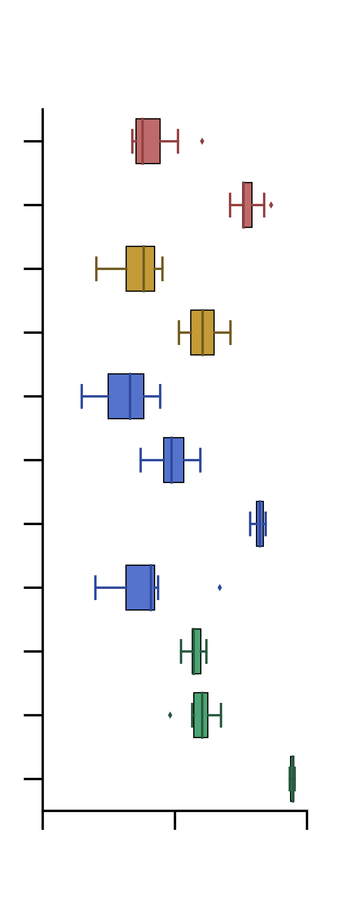

# bsoid_figs

### Python scripts to generate manuscript figure panels

#### fig2.py
`python fig2.py` 

Runs the following subroutines
* Computes K-fold validation accuracy, saves the accuracy_data.

`./subroutines/kfold_accuracy.py -p, path, -f, file, -o, label_order, -k, kfold_validation, -v, variable_filename`

* Boxplot representation for K-fold validation accuracy.

`./subroutines/accuracy_boxplot.py -p, path, -f, file, -v, variable_filename, -a, algorithm, -c, c, 
-m, fig_format, -o, outpath`

<!-- .element height="10%" width="50%" -->

* Plots limb trajectories for behaviors.

`./subroutines/trajectory_plot.py -p, path, -f, file, -i, animal_index, -b, bodyparts, -t, time_range,
-r, top_plot_bodyparts, -R, bottom_plot_bodyparts, -c, colors, -m, fig_format, -o, outpath`

